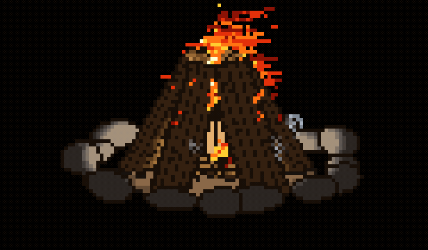

# fireplace-experiment

A real-time physical bonfire Pomodoro timer rendered as 3D pixel art in the terminal.

Focus while the campfire burns. Each session ignites kindling, transitions into a roaring teepee fire, snaps and settles into glowing ember coals, and slowly extinguishes when your focus time ends. Completed sessions are logged to keep track of your focus history.



## How It Works

- **Pomodoro Cycle**: By default, a session runs for 50 minutes (standard natural firewood burn). You can set custom durations like `--time 25` for classic Pomodoro sessions.
- **Dynamic Physical Combustion**: Logs undergo 1D thermal diffusion along the wood grain, dry out moisture, char, fracture at weakened stress points, and fall with ragdoll gravity into the coal bed.
- **Randomized Wood Species**: Randomizes between Carvalho (Oak), Pinho (Pine), Bétula (Birch), and Cerejeira (Cherry), each with unique palettes, crackle frequency, and burn properties.
- **Focus History**: Finished sessions are automatically logged to `~/.bonfire_history.json`.
- **ANSI Half-Block Pixel Art**: 24-bit TrueColor characters (`▀`) rendered at 60 FPS with native terminal background transparency.

## Usage

### Quick Start

```bash
make
./fireplace
```

### CLI Options

```bash
# Start a 25-minute Pomodoro session
./fireplace --time 25

# Specify a wood species (carvalho, pinho, betula, cerejeira)
./fireplace --wood pinho --time 45

# View past completed focus sessions
./fireplace --history

# Fast preview mode (30x speed)
./fireplace --fast
```

## Controls

| Key | Action |
| --- | --- |
| `←` / `→` or `a` / `d` or `h` / `l` | Orbit camera yaw (rotate left/right) |
| `↑` / `↓` or `w` / `s` or `k` / `j` | Orbit camera pitch (tilt up/down) |
| `Space` or `g` or `t` | Toggle automatic 360° turntable rotation |
| `f` | Stoke fire / drop new firewood with ragdoll physics |
| `r` | Rekindle / restart bonfire session |
| `q` | Quit session |

## Features & Simulation Details

- **3D Stone Hearth**: 16 ellipsoidal fieldstones with perimeter contact forming a natural ring.
- **Ragdoll Wood Physics**: Burning logs snap unevenly when central mass is exhausted and drop onto the hearth floor with physical impulse and bounce restitution.
- **Smart Stoking (`f`)**: Accepts new firewood into natural open gaps in the teepee cone with fire capacity limits.
- **Turntable & Snapshot Exporter**: Headless rendering to PPM/GIF for captures (`--snapshot` and `--turntable`).

## Documentation

See [docs/architecture.md](docs/architecture.md) for technical notes on the raycast shader, combustion equations, and geometry pipeline.
