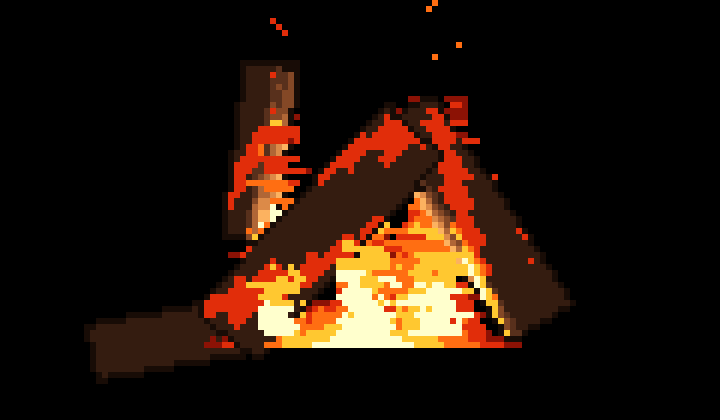

# fireplace-experiment

Real-time physical bonfire simulation rendered as 2D pixel art over 3D geometric models in the terminal.

Uses a per-object pixel art shader pipeline with object-space snapping to eliminate pixel creep, stepped cel-shading, 1-pixel discontinuity outlines, and Unicode half-block characters (`▀`) for square pixel aspect ratio at 60 FPS with terminal transparency support.



## Key Techniques

- **Object-Space Texel Snapping (Anti-Pixel Creep)**: Wood grain and fissures are mapped in the local cylindrical frame of each log (`floor(uv * texels) / texels`). As logs rotate, tilt, or collapse under gravity, texels remain rigidly bound to the mesh rather than swimming across screen space.
- **Stepped Cel-Shading**: 3D point light from the fire core casts banded illumination onto the cylinders using curated 5-stage color ramps (dark bark, heartwood, firelit amber, glowing ember cracks).
- **1-Pixel Outlines**: Screen-space edge detector over the object ID and depth buffers paints dark contour pixels at silhouette boundaries without anti-aliasing blur.
- **Volumetric Fire Interleaving**: Convective flame grid with twin spires and incandescent core tested against the log depth buffer, allowing fire to wrap naturally both in front of and behind the wood.
- **Falling Sand Ash Physics**: Burnt wood peels off as physical ash flakes that fall with gravity, roll over sloped log contours, and pile up at the hearth base.
- **ANSI Half-Block Output**: Encodes two vertical pixels per character cell (`\033[38;2;...m\033[48;2;...m▀`) with full native terminal background transparency.

## Building & Running

### C Engine (Recommended)

Requires GCC or Clang with POSIX terminal support:

```bash
make
./fireplace
```

### Python Prototype

Requires Python 3.8+:

```bash
python3 bonfire.py
```

## Controls

| Key | Action |
| --- | --- |
| `r` | Rekindle / restart bonfire lifecycle |
| `c` | Trigger immediate structural log collapse |
| `+` / `-` | Increase / decrease simulation speed |
| `Space` | Pause / resume simulation |
| `q` | Quit and restore terminal |

## Documentation

See [docs/architecture.md](docs/architecture.md) for detailed notes on the 3D pixel art shader math, combustion stages, and experiment log.
