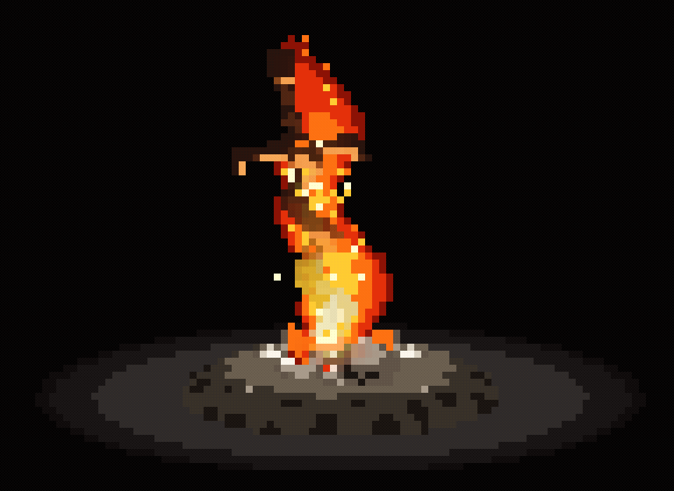

# bonfire-pomodoro

A Dark Souls-inspired physical bonfire Pomodoro timer rendered in 3D TrueColor ASCII art directly in your Linux terminal. Single C99 source file, zero external dependencies beyond libc and libm.



## The Experience

- **Kindle the Flame**: Press `[E]` to light the unlit bonfire. The coiled sword heats up, sparks burst in a radial explosion, and a roaring fire erupts around the skull bone mound.
- **Ambient Sound**: Authentic crackling bonfire audio streams directly into PipeWire / PulseAudio / ALSA via embedded 16-bit PCM with seamless crossfading.
- **Cycle Transitions**: When your focus session ends, the authentic Dark Souls *Item Discovery* chime rings, an on-screen banner appears, and the fire settles into smoldering embers for your break.
- **Desktop Notifications**: Background desktop alerts via `notify-send` and terminal bell (`\a`) keep you on track even when the window is behind your editor or on another workspace.
- **Continuous 360° Orbit**: Hit `Space` at any moment to toggle a continuous turntable camera loop orbiting the 3D coiled sword and flame.
- **Smart Mute**: Muting (`[M]`) silences ambient crackling while keeping the end-of-cycle chime audible at a subtle, non-intrusive volume (~15%).

## Quick Start

### Build & Run

```bash
git clone https://github.com/GabrielBaiano/bonfire-pomodoro.git
cd bonfire-pomodoro
make
./bonfire
```

### Install Globally

Install `bonfire` (and `fireplace` alias) to `~/.local/bin`:

```bash
make install
```

Make sure `~/.local/bin` is in your `$PATH`. You can then launch it from anywhere simply by typing:

```bash
bonfire
```

## CLI Usage

```bash
# Interactive setup menu (style, intervals, volume)
bonfire

# Direct launch into Dark Souls Bonfire mode
bonfire --souls

# Set custom focus duration (in minutes)
bonfire --souls --time 25

# Classic wood fireplace mode with combustion physics
bonfire --wood carvalho --time 45

# View completed Pomodoro session logs
bonfire --history

# Fast preview mode (30x simulation speed)
bonfire --fast
```

## Interactive Controls

| Key | Action |
| --- | --- |
| `[E]` / `Enter` | Kindle bonfire (when unlit/extinguished) or stoke sparks |
| `Space` (or `g` / `t`) | Toggle continuous 360° turntable rotation loop |
| `[P]` | Pause / resume current Pomodoro phase |
| `[S]` | Skip phase (Focus → Rest → Next Focus) |
| `[M]` | Mute / unmute ambient audio (keeps subtle alert chime) |
| `[` / `]` or `-` / `+` | Decrease / increase sound volume (10% steps) |
| `←` / `→` or `a` / `d` or `h` / `l` | Orbit camera yaw (rotate left/right) |
| `↑` / `↓` or `w` / `s` or `k` / `j` | Orbit camera pitch (tilt up/down) |
| `r` | Rekindle / restart session from unlit state |
| `q` | Quit session |

## Technical Highlights

- **3D Raymarching in ANSI**: Procedural coiled sword (helical SDF geometry), skull mound, and stone hearth rendered using character half-block sub-pixels (`▀`) with 24-bit TrueColor at 60 FPS.
- **Physical Combustion Simulation**: Convective cellular automata fire with thermal diffusion along wood grain, moisture evaporation, charring, and physical log breakage.
- **Embedded Audio Engine**: Embedded 16-bit 22.05 kHz PCM streams directly through user-space pipes into system sound servers without linking SDL, OpenAL, or external sound libraries.
- **Config & History Persistence**: Settings persist to `~/.fireplace_conf` and completed focus intervals log to `~/.bonfire_history.json`.
## Architecture & Notes

Technical notes on the raymarching shader, thermal balance equations, and ragdoll log physics can be found in [docs/architecture.md](docs/architecture.md).

