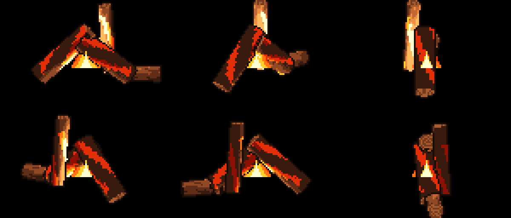
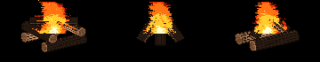
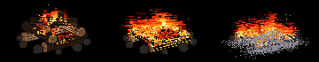
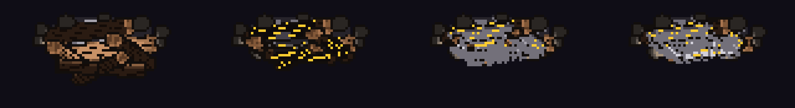
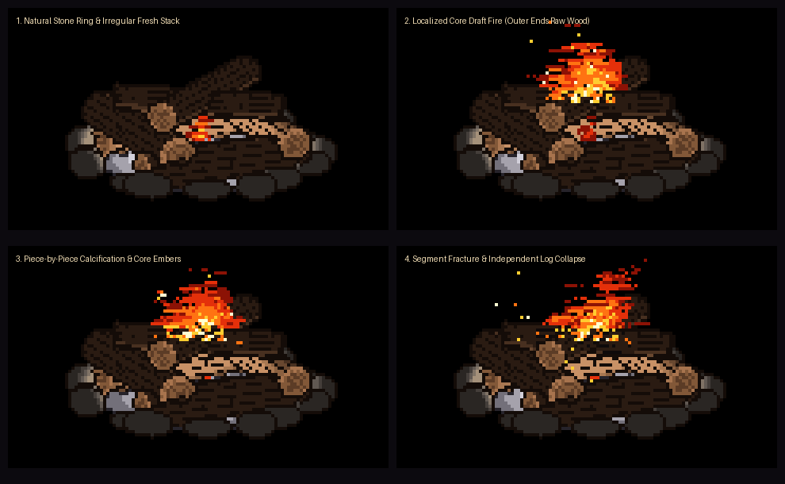
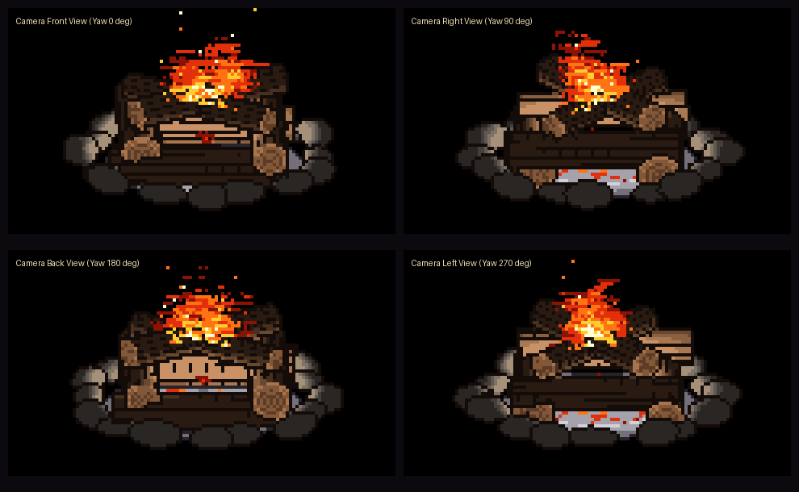

# Technical Architecture & Experiment Notes

This document records the design decisions, mathematical formulations, and iterative discoveries made during the development of the terminal 3D pixel art bonfire engine.

---

## 1. The 3D-to-Pixel-Art Pipeline

Naive approaches to 3D pixel art usually apply a full-screen downsampling post-process filter. This produces three critical artifacts:
1. **Subpixel Jitter & Pixel Creep**: Edges and surface details swim across the screen as objects or camera move fractionally.
2. **Inconsistent Texel Density**: Distant objects lose character resolution while foreground objects display coarse pixels.
3. **Loss of Silhouette Definition**: High-contrast edges blend into neighbor pixels without clean artist-drawn outlines.

To solve this, the engine implements a per-object shader pipeline:

```
[3D Mesh / Cylinder Definition]
          │
          ▼
[Raycasting & Depth Pass] ───────► Object ID Buffer & Depth Buffer
          │
          ▼
[Object-Space UV Snapping] ──────► Anti-Pixel Creep (texels rigidly bound to mesh)
          │
          ▼
[Stepped Cel-Shading Ramp] ──────► Quantized point-light from fire core
          │
          ▼
[1-Pixel Discontinuity Filter] ──► Sharp silhouette outline
          │
          ▼
[3D Fire & Depth Interleaving] ──► Flames wrap before/behind logs
          │
          ▼
[Half-Block ANSI Presenter] ─────► 2 vertical pixels per cell (`▀`)
```

---

## 2. Object-Space Texel Snapping (Anti-Pixel Creep)

### Problem
When sampling surface patterns in continuous screen space, fractional movements of the model cause texel boundaries to shift between raster pixels, creating a flickering/sliding effect.

### Solution
Coordinates are computed in the local coordinate frame of each 3D cylinder:
- Cylinder axis $\vec{A} = \vec{P}_2 - \vec{P}_1$, length $L = \|\vec{A}\|$, direction $\hat{D} = \vec{A} / L$.
- Reference up vector $\hat{R}$ defines orthogonal tangents:
  $$\hat{T} = \frac{\hat{D} \times \hat{R}}{\|\hat{D} \times \hat{R}\|}, \quad \hat{B} = \hat{D} \times \hat{T}$$
- For any intersection point $\vec{P}_{\text{hit}}$ with surface normal $\hat{N}$:
  $$v = \frac{(\vec{P}_{\text{hit}} - \vec{P}_1) \cdot \hat{D}}{L}, \quad u = \frac{\text{atan2}(\hat{N} \cdot \hat{B}, \hat{N} \cdot \hat{T}) + \pi}{2\pi}$$
- Texture coordinates are then snapped to fixed discrete cells:
  $$u_{\text{snap}} = \frac{\lfloor u \cdot N_{\text{radial}} \rfloor}{N_{\text{radial}}}, \quad v_{\text{snap}} = \frac{\lfloor v \cdot N_{\text{longitudinal}} \rfloor}{N_{\text{longitudinal}}}$$

Because $(u_{\text{snap}}, v_{\text{snap}})$ are defined in the object's local frame, moving, tilting, or collapsing the log rotates the pixel grid rigidly with the geometry.

---

## 3. Curated Stepped Palettes & Cel-Shading

Continuous lighting ramps (Phong/Blinn-Phong) break pixel art aesthetics. The engine uses discrete banded shading:

### Light Calculation
From the fire's 3D point light $\vec{P}_{\text{light}}$ with intensity $I$:
$$\vec{L} = \vec{P}_{\text{light}} - \vec{P}_{\text{hit}}, \quad d = \|\vec{L}\|, \quad \hat{L} = \frac{\vec{L}}{d}$$
$$\text{Atten} = \frac{1}{1 + 0.10 d + 0.02 d^2}$$
$$I_{\text{diffuse}} = \max(0, \hat{N} \cdot \hat{L}) \times \text{Atten} \times I_{\text{fire}} + I_{\text{ambient}}$$

### Color Ramp Ramps
The scalar $I_{\text{diffuse}}$ is quantized into discrete bands:

- **Oak Wood**:
  - `Band 0 (Outline)`: `#180C06`
  - `Band 1 (Shadow Bark)`: `#341C10`
  - `Band 2 (Dark Oak)`: `#58301C`
  - `Band 3 (Mid Grain)`: `#844826`
  - `Band 4 (Heartwood)`: `#B06636`
  - `Band 5 (Firelit Timber)`: `#DC8A48`
  - `Band 6 (Rim Highlight)`: `#FCB260`

- **Cut End-Caps**:
  - Concentric tree rings: $r_{\text{fraction}} = \|\vec{P}_{\text{hit}} - \vec{P}_{\text{cap}}\| / R$.
  - Quantized rings: $\lfloor r_{\text{fraction}} \times 7 \rfloor \pmod 2$.

- **Embers & Fire**:
  - Deep Red `#8C1205` $\to$ Bright Red `#E12D0A` $\to$ Hot Orange `#FF6E12` $\to$ Yellow `#FFC830` $\to$ White Core `#FFFFCD`.

- **Ash & Charcoal**:
  - Charcoal `#302D34` $\to$ Dark Ash `#58545E` $\to$ Mid Grey `#87848E` $\to$ Chalky Light `#B9B6C0` $\to$ White Powder `#E6E4EB`.

---

## 4. 1-Pixel Edge Detection (Outlines)

To create crisp hand-drawn pixel art outlines, a neighborhood discontinuity test is performed on the G-buffer:
$$\Delta_{\text{ID}} = \text{ID}(x, y) \neq \text{ID}(x \pm 1, y \pm 1)$$
$$\Delta_{\text{depth}} = |\text{Depth}(x, y) - \text{Depth}(x \pm 1, y \pm 1)| > \epsilon$$

If either condition is met, the pixel is drawn using the darkest material tone (`#180C06`), yielding a strictly 1-pixel-thick border without anti-aliasing blur.

---

## 5. 7-Stage Combustion Lifecycle

1. **Stage 1 (0-12s)**: Kindling ignition. Tiny flame in central cradle between Log 1 and Log 2.
2. **Stage 2 (12-35s)**: Flame catches onto the logs. Twin convective spires begin to form.
3. **Stage 3 (35-80s)**: Roaring bonfire at peak heat. Tallest right spire reaches apex, left spire licks upright branch, sparks launch into updraft.
4. **Stage 4 (80-120s)**: Wood surface ashens. Loose chalky ash flakes detach under heat and drift downward.
5. **Stage 5 (120-150s)**: Structural collapse. Core wood degrades, 3D logs lose structural support and sag/fall toward the hearth base.
6. **Stage 6 (150-195s)**: Glowing ember bed. Open flames die down; logs rest as glowing charcoal heaps.
7. **Stage 7 (195s+)**: Cold ash mound. Heat dissipates into residual white and grey ash pile.

---

## 6. 3D Camera Orbit & Projection Math

To allow free 3D camera rotation around the hearth without pixel creep:

1. **Orbit Coordinates**: Given distance $R$, target $\vec{T} = (0, -1.2, 0)$, yaw $\theta$, and pitch $\phi$:
   $$\vec{P}_{\text{cam}} = (R \cos\phi \sin\theta, \; T_y + R \sin\phi, \; -R \cos\phi \cos\theta)$$
2. **Camera Basis**:
   $$\vec{F} = \frac{\vec{T} - \vec{P}_{\text{cam}}}{\|\vec{T} - \vec{P}_{\text{cam}}\|}, \quad \vec{R} = \frac{\vec{F} \times (0, 1, 0)}{\|\vec{F} \times (0, 1, 0)\|}, \quad \vec{U} = \vec{R} \times \vec{F}$$
3. **Ray Generation**: For screen pixel $(x, y)$ mapped to viewport dimensions $(W_w, W_h)$:
   $$\vec{P}_{\text{ray}} = \vec{P}_{\text{cam}} + w_x \vec{R} + w_y \vec{U}, \quad \vec{D}_{\text{ray}} = \vec{F}$$
4. **World-to-Camera Projections**: 3D fire emitters, sparks, and ash particles project onto the camera plane via:
   $$x_{\text{screen}} = \left(\frac{(\vec{P} - \vec{P}_{\text{cam}}) \cdot \vec{R}}{W_w} + 0.5\right) W_{\text{pixels}}$$
   $$y_{\text{screen}} = \left(0.5 - \frac{(\vec{P} - \vec{P}_{\text{cam}}) \cdot \vec{U}}{W_h}\right) H_{\text{pixels}}$$
   $$z_{\text{depth}} = (\vec{P} - \vec{P}_{\text{cam}}) \cdot \vec{F}$$



---

## 7. Physical Wood Stacking Geometries & Bark Plate Shading

### 1. The Three Stacking Archetypes
1. **Fogueira Quadrada / Cabana de Troncos (`Log Cabin` / `Cribbing`)**:
   - Built with alternating orthogonal tiers forming a hollow chimney core.
   - **Tier 1 (Base on Ground)**: 2 parallel logs aligned on the X-axis ($Y = Y_{\text{ground}} + R_1$).
   - **Tier 2 (Perpendicular Mid)**: 2 logs resting across Tier 1 along the Z-axis at notched contact height:
     $$Y_2 = Y_1 + R_1 + R_2 - \delta_{\text{notch}}$$
   - **Tier 3 (Diagonal Top Braces)**: 2 bracing logs resting across Tier 2.
   - Gravity collapse: As base logs burn through, upper tiers drop down to ground level under gravity.

2. **Tenda Cônica (`Teepee` / `Cone`)**:
   - 5 radial logs arranged in a circle on the ground ($Y = Y_{\text{ground}} + R$), leaning inward to a central apex lock:
     $$\vec{P}_{1, i} = (R_{\text{base}} \cos\theta_i, \; Y_{\text{ground}} + R, \; R_{\text{base}} \sin\theta_i)$$
     $$\vec{P}_{2, i} = (R_{\text{apex}} \cos\theta_i, \; Y_{\text{apex}}, \; R_{\text{apex}} \sin\theta_i)$$
   - Gravity collapse: When apex support degrades, tips roll inward and collapse flat onto the hearth.

3. **Pirâmide com Escora (`Pyramid / Lean-to`)**:
   - 2 heavy foundation logs on the ground supporting 3 angled cross logs over the kindle cradle.

### 2. Discrete Bark Plate Shading (Zero Periodic Stripes)
Sinusoidal oscillations (`sin(k * u)`) create zebra/tiger striping artifacts across cylindrical meshes. The engine replaces this with discrete 2D cellular bark plates:
$$u_{\text{plate}} = \lfloor u \times 14 \rfloor, \quad v_{\text{plate}} = \lfloor v \times (L \times 2.2) \rfloor$$

- Plate borders ($u_{\text{frac}} < 0.12$ or $u_{\text{frac}} > 0.88$) define deep bark furrows painted with shadow `#140C08`.
- Raised bark plates receive natural oak tones (`#2A1B12` to `#A87A55`).
- Concentric growth rings on cut ends use quantized radius fractions: $\lfloor r_{\text{frac}} \times 8 \rfloor \pmod 2$.
- Incandescent embers and charcoal charring appear **exclusively** on surfaces directly exposed to combustion heat ($d_{\text{core}} < 4.8$ and $E_{\text{heat}} > 0.45$).



---

## 8. Experiment Discoveries & Fixes Log

| Issue | Root Cause | Solution |
| --- | --- | --- |
| Fire losing contrast on transparent terminal | Native black/blue background was stripped completely | Preserved terminal background transparency when `is_sky == true`, while logs and fire retain fully opaque color blocks. |
| ASCII glyphs looking like alphabet soup | Character glyphs (`L, J, F, %, 3, K`) degraded pixel fidelity | Switched to Unicode half-block characters (`▀`, `▄`), doubling vertical resolution and providing true square pixels. |
| Wood logs completely invisible | Comma operator typo in C outline pass: `g_id_buf[y, x][0]` evaluated to `g_id_buf[x][0] == 0` | Fixed to `g_id_buf[y][x]`. Wood now renders with full cel-shading, outlines, and tree rings. |
| Fire drawn strictly behind logs | Fire simulation lacked 3D depth testing | Integrated fire Z coordinate testing against log depth buffer, allowing flames to wrap organically around logs. |
| Fire appearing to ignite the dirt floor | Heat injected into a flat horizontal floor strip (`base_y`) | Seeded fire directly from the 3D wood contact surfaces and the elevated central cradle. Floor now only catches settled ash. |
| Floating logs without gravity | Cylinder coordinates lacked a ground plane and had floating pivots | Defined ground plane at $Y = -4.2f$, grounded all base pivots, and implemented rotational gravity collapse around base pivots. |
| Logs remaining dark in shadow of roaring fire | Light placed behind logs with rigid Lambertian cutoff ($N \cdot L \le 0$) | Placed flickering light source forward at $Z = -1.2f$ and applied Half-Lambert wrap lighting $\frac{N \cdot L + 0.45}{1.45}$, bathing curved log faces in warm amber and golden bands. |
| Fixed camera angle preventing 3D scene inspection | Orthographic rays were locked to fixed $+Z$ vector | Implemented 3D spherical orbit camera with yaw/pitch rotation, real-time keyboard controls (`←/→/↑/↓`, `WASD`), and auto-turntable mode. |
| Unrealistic orange/red tiger stripes on wood | Trigonometric functions `sin(38*u)` and `sin(18*u + 8*v)` triggered ember palette and bright orange color bands | Replaced with discrete object-space cellular bark plates, natural oak/pine palette, and confined glowing embers strictly to fire-exposed charred crevices. |
| Chaotic and arbitrary log stack | 4 hardcoded logs hovered and leaned unnaturally | Researched and implemented 3 classic bonfire stacking geometries (Log Cabin, Teepee, and Pyramid) with physical contact notches and gravity collapse. |
| Fire spawning out of the ground | Residual hardcoded heat disc at floor elevation $Y = -4.2f$ | Removed floor heat injection entirely; fire anchors strictly to kindle bundle $(0, -2.6, 0)$ and burning wood segments ($T > 0.35$). |
| Firewood burning as a single monolithic block | Single global burn progress per log caused uniform discoloration | Discretized each log into $N_{\text{seg}} = 10$ axial cells with independent heat conduction, charring, ash degradation, and mass loss. |
| Bonfire floating on bare ground without containment | Absence of physical containment structure | Added 10 rounded 3D stones in a circular fire ring at $R = 7.0$ resting on the ground plane with stone palette and firelight reflections. |
| Ash appearing as random noise / TV static | 2D screen buffer `g_settled_ash` stamped checkerboard pixels and pseudo-random hash `plate_hash` scattered salt-and-pepper dots | Replaced with analytical 3D dome mound (`AshBed3D`) with coherent ember fissures, and gravity-settled wood ash mantle on top surfaces ($N_y > 0$). |

---

## 9. 3D Stone Fire Ring Containment Base

### Geometry
A ring of $N_{\text{stones}} = 10$ ellipsoidal rocks encircles the hearth at radius $R_{\text{ring}} = 7.0$:
$$\theta_i = \frac{2\pi i}{N_{\text{stones}}} + \delta\theta_i$$
$$\vec{C}_i = \left((R_{\text{ring}} + \delta r_i) \cos\theta_i, \; Y_{\text{ground}} + R_{y, i} \cdot 0.7, \; (R_{\text{ring}} + \delta r_i) \sin\theta_i\right)$$

Each stone is modeled as a flattened sphere with semi-axes $(R_x, R_y, R_z)$ where $R_y \approx 0.8 \times R_{x, z}$, sunken into the ground plane ($Y_{\text{ground}} = -4.2$).

### Ray Intersection & Shading
Rays test analytical sphere intersections:
$$(\vec{P}_{\text{ray}} + t \hat{D} - \vec{C}) \cdot (\vec{P}_{\text{ray}} + t \hat{D} - \vec{C}) = R^2$$
Surfaces are shaded using the discrete granite/basalt palette `PALETTE_STONE`:
- Stepped diffuse illumination from fire core: $I_{\text{stone}} = \max(0, \hat{N} \cdot \hat{L}) \times \text{Atten} \times I_{\text{fire}} + I_{\text{ambient}}$.
- Firelit stone highlights (`#7A6A58` to `#9E8C78`) facing inward toward the flames.
- Dark basalt shadow tones (`#1E1C1A` to `#353230`) facing outward away from the hearth.
- Screen-space 1-pixel discontinuity outlines separate individual adjacent stones.

---

## 10. Segmented Firewood Combustion & Self-Collapse



### 1. Longitudinal Discretization
Each cylinder of length $L$ is divided into $N_{\text{seg}} = 10$ discrete segments along its axis $\hat{D}$:
$$\vec{P}_{\text{seg}}(s) = \vec{P}_1 + \left(\frac{s + 0.5}{N_{\text{seg}}}\right) (\vec{P}_2 - \vec{P}_1), \quad s \in [0, N_{\text{seg}} - 1]$$

Each segment maintains:
- `temp` $\in [0, 1]$: Local thermal state.
- `burn_progress` $\in [0, 1]$: Cumulative combustion consumption.
- `structural_mass` $\in [0, 1]$: Remaining mechanical strength.

### 2. Heat Conduction & Ignition
1. **Kindling Contact**: At startup, central kindling at $\vec{P}_{\text{kindle}} = (0, -2.6, 0)$ transfers heat to log segments within effective surface distance $d_{\text{surf}} < 2.8$:
   $$\Delta T_{\text{kindle}} = 0.0035 \times \left(1 - \frac{d_{\text{surf}}}{2.8}\right) \times I_{\text{kindle}}$$
2. **Axial Conduction**: Heat diffuses along adjacent segments of the same log:
   $$\frac{\partial T(s)}{\partial t} = k_{\text{diff}} \left(T(s - 1) - 2T(s) + T(s + 1)\right)$$
3. **Cross-Log Proximity**: Burning segments ($T > 0.4$) radiate heat to segments on neighboring logs within proximity radius $r_{\text{contact}} < 3.2$.

### 3. Progressive Material Lifecycle
For each hit point $\vec{P}_{\text{hit}}$, the local segment index $s = \min(9, \lfloor v \cdot 10 \rfloor)$ determines the rendering state:

1. **Fresh Wood ($B < 0.15$)**: Discrete bark plates with natural brown oak palette (`PALETTE_OAK`).
2. **Smoking / Warm ($0.15 \le B < 0.35$)**: Darkened scorched bark, heat haze distortion.
3. **Active Combustion ($0.35 \le B < 0.70$)**: Alligator charring crust (`#120B08` to `#241812`) interlaced with glowing orange ember fissures (`#E12D0A` to `#FFC830`). Segment emits convective flame particles into the fluid grid.
4. **Brittle Ash ($0.70 \le B < 0.95$)**: Chalky grey and white mineral crust (`PALETTE_ASH`). Mass loss causes ash flakes to peel off and fall with gravity.
5. **Disintegration ($B \ge 0.95$)**: Segment core hollows out; effective ray radius $R_{\text{eff}} = R \times \text{mass}$ shrinks to zero.

### 4. Mass-Loss-Driven Structural Collapse
When average structural mass $\bar{M} = \frac{1}{N} \sum M_i$ drops below critical stability thresholds:
1. **Sagging ($0.45 < \bar{M} \le 0.75$)**: Top tiers sag downward, resting notches deepen.
2. **Structural Fracture ($0.25 < \bar{M} \le 0.45$)**: Weakened segments lose cantilever support; logs rotate around ground contact points toward the central hearth floor.
3. **Full Collapse ($\bar{M} \le 0.25$)**: All consumed logs settle flat onto ground plane ($Y = -4.2$), forming a glowing ember bed enclosed by the stone ring.

---

## 11. Physical 3D Ash Bed & Gravity-Settled Wood Ash Mantle



### 1. Eliminating Pseudo-Random Ash Noise
Earlier prototypes used a pseudo-random hash function (`plate_hash = sin(u * 12.98 + v * 78.23) * 43758.54`) and a 2D screen buffer (`g_settled_ash[sy][sx]`). This generated high-frequency salt-and-pepper noise and static screen-space dots that drifted unnaturally during camera orbit.

### 2. Analytical 3D Hearth Ash Bed (`AshBed3D`)
The hearth bed inside the stone ring is modeled as an analytical 3D ellipsoid dome:
$$\frac{x^2}{R_{\text{bed}}^2} + \frac{(y - Y_{\text{ground}})^2}{H_{\text{bed}}^2} + \frac{z^2}{R_{\text{bed}}^2} \le 1, \quad y \ge Y_{\text{ground}}$$
- **Radius**: $R_{\text{bed}} = 5.6f$ (contained inside the stone ring $R_{\text{stones}} = 7.0f$).
- **Height Dynamics**: $H_{\text{bed}}(t) = 0.35 + 0.85 \times (1 - \bar{M}) + V_{\text{flakes}}$, rising from $0.35$ up to $1.4$ as wood is consumed.
- **Continuous Cellular Fissures**: Continuous harmonic function $F(x, z) = |\sin(1.3x + 0.7z) \cos(1.4z - 0.6x)|$. Where $F < 0.18$ and core temperature is high, incandescent glowing ember veins peek through. Elsewhere, a calcified ash mantle is rendered with stepped diffuse shading.

### 3. Gravity-Dependent Wood Ash Mantle
In real campfires, ash is a delicate powdery residue that settles on the upward-facing surfaces of burning logs:
- **Top Crests ($\hat{N}_y > 0.25$)**: Thick chalky white and light ash (`PALETTE_ASH[3..4]`).
- **Flanks ($-0.1 \le \hat{N}_y \le 0.25$)**: Mid-grey ash (`PALETTE_ASH[1..2]`).
- **Underside ($\hat{N}_y < -0.1$)**: Ash flakes shed off into the fire below, leaving the black charred charcoal crust (`PALETTE_CHARRED`).
- **Crevices / Furrows**: Deep grooves retain incandescent glowing embers (`PALETTE_EMBERS`), preserving the structural volume and silhouette of the burning firewood.

---

## 12. Natural Interlocking Stones, Irregular Firewood, Core Draft & Independent Collapse



### 1. Anisotropic Interlocking Stone Ring (`Stone3D`)
Spherical bead approximations produce artificial, disconnected rings. The hearth containment wall is built from $N_{\text{stones}} = 16$ oriented fieldstone ellipsoids:
- **Local Orthonormal Frame**: For stone $i$ at angle $\theta_i$, local axes align with the ring perimeter:
  $$\hat{U}_{\text{tan}} = (-\sin\theta_i, 0, \cos\theta_i), \quad \hat{V}_{\text{up}} = (0, 1, 0), \quad \hat{W}_{\text{rad}} = (\cos\theta_i, 0, \sin\theta_i)$$
- **Anisotropic Semi-Axes**: Elongated along the perimeter ($R_u \approx 1.45$), flattened vertically ($R_v \approx 0.78$), and deep radially ($R_w \approx 1.10$). Adjacent stones touch and interlock seamlessly, forming an organic circular containment wall.
- **Analytical Ray Intersection**: The ray is transformed into the stone's unit-sphere space via dot products with $(\hat{U}, \hat{V}, \hat{W})$ scaled by $(1/R_u, 1/R_v, 1/R_w)$. World normals are reconstructed by projecting the local normal back through the oriented frame.
- **Mineral Variety**: Each rock carries an individual shade perturbation scalar (`shade_var`), giving subtle slate, granite, and sandstone tonal variety.

### 2. Irregular, Organic Firewood Stacks
Campfire firewood consists of hand-cut, split logs with natural variation:
- **Log Cabin (Cribbing)**: Asymmetric tier log diameters ($R \in [0.92, 1.32]$), non-uniform cut lengths ($9.1$ to $10.6$), and slight angular yaw tilts ($\pm 2.5^\circ$ to $4^\circ$).
- **Teepee**: 5 leaning poles with randomized radii and asymmetric apex grouping leaning against a dominant primary trunk.
- **Pyramid / Lean-to**: Ground base trunks of unequal gauge ($R = 1.38$ and $1.26$) supporting leaning logs that overhang unevenly.

### 3. Central Chimney Draft & Localized Combustion ($\eta(r)$)
In real hearths, convective updraft pulls fresh air into the fire from all sides, creating an intense central chimney draft while outer ends remain cool:
- **Radial Draft Factor**:
  $$\eta(r) = \max\left(0, 1 - \left(\frac{r_{\text{seg}}}{3.6}\right)^2\right), \quad r_{\text{seg}} = \sqrt{x^2 + z^2}$$
- **Slow 1D Grain Diffusion**: Replaces runaway additive jumps with conservative 1D thermal diffusion along adjacent segments:
  $$\Delta T_{\text{diff}}(s) = k_{\text{diff}} (T(s - 1) - 2T(s) + T(s + 1))$$
- **Ambient Convective Cooling**:
  $$\Delta T_{\text{cool}} = -k_{\text{cool}} \cdot T(s) \cdot (1 - 0.75 \eta(r))$$
  Outer log segments ($r > 3.6$, $\eta(r) = 0$) cool down into ambient air faster than diffusion can heat them, preventing ignition and keeping outer ends as raw, intact oak wood throughout the fire's life.
- **Core-Anchored Flames**: Fire fluid injection is modulated by $\eta(r)$. Segments outside the draft zone emit zero vertical flame columns, concentrating the visible roaring fire strictly within the central hearth chimney ($r < 3.2$).

### 4. Independent, Segment-Driven Collapse Kinematics
Instead of a uniform global lerp, each log tracks its own mechanical integrity and physical collapse progression:
- **Support Graph**:
  - Ground tier logs (`support = -1`) remain grounded until central segments lose mass.
  - Tier 2 logs monitor support at contact points on underlying Tier 1 logs.
  - Tier 3 logs monitor support on Tier 2 logs.
- **Fracture Trigger**: When local support integrity or a log's own central segments ($s \in [4, 6]$) drop below critical threshold ($< 0.45$), the log loses structural equilibrium.
- **Gravitational Settling**: The log accelerates downward with independent settling velocity:
  $$\vec{P}(t) = \vec{P}_{\text{orig}} (1 - c_i) + \vec{P}_{\text{collapsed}} c_i, \quad c_i \in [0, 1]$$
  Logs tip, tilt, and drop asynchronously into the glowing ember bed as specific supporting wood burns away.




